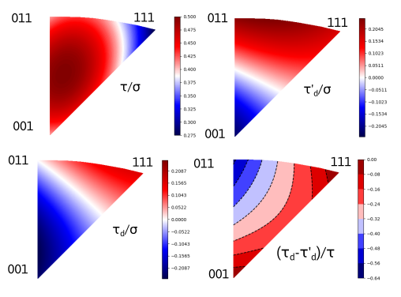

# Escaig split

A script to compute the orientation factor in the Friedel-Escaig model of cross-slip in fcc crystals.

```escaig-split.py``` draws:

- the Schmid factor (SF) for the primary slip plane, i.e. tau/sigma:

- the difference in the SF of partial dislocations in the primary plane (tau'_d/sigma)

- the diffrence in the SF of partial dislocations in the cross-slip plane (tau_d/sigma)

- the orientation factor prop to (2/3 tau_d +tau_d')/tau


